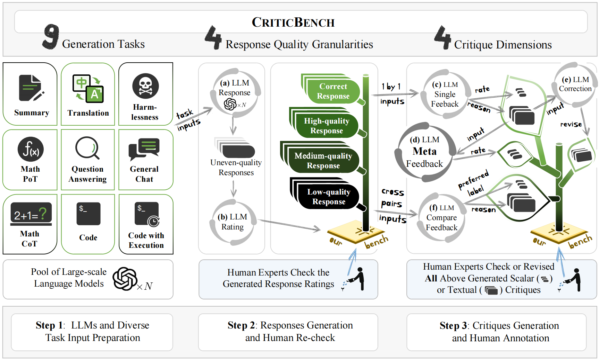
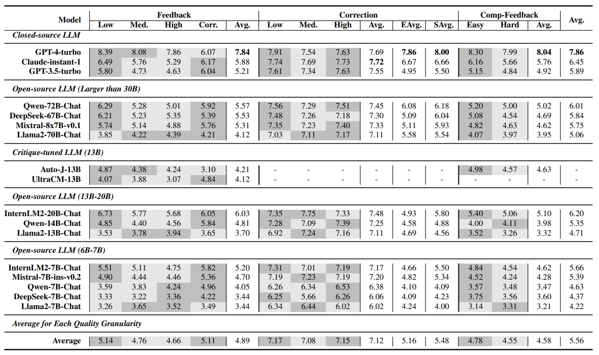
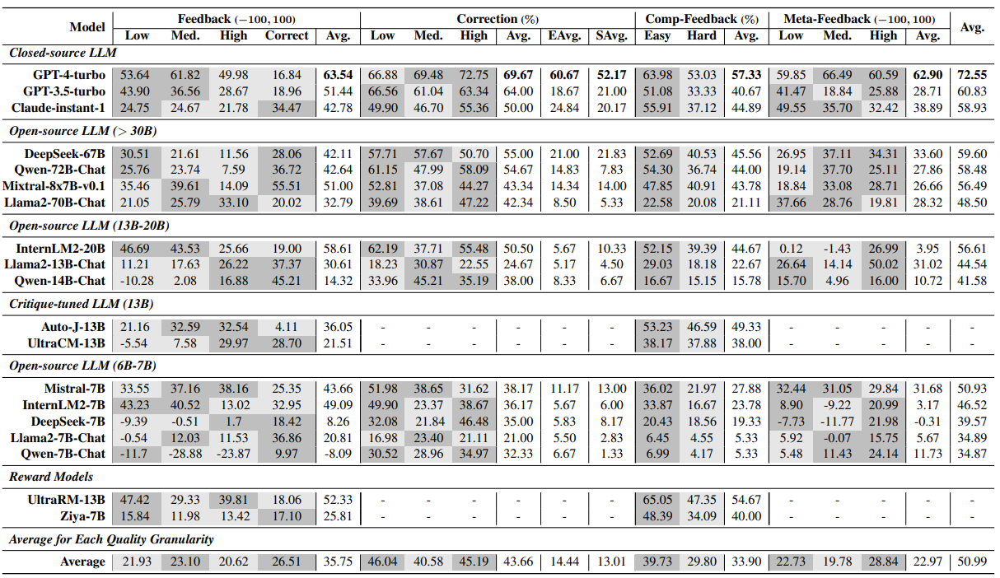

# CriticBench

This repository is the official implementation of [CriticBench](https://arxiv.org/abs/2307.04725), a comprehensive benchmark for evaluating critique ability of LLMs.

## Introduction

**[CriticBench: Evaluating Large Language Model as Critic](https://arxiv.org/abs/2307.04725)** 
</br>
Tian Lan<sup>1*</sup>,
Wenwei Zhang<sup>2*</sup>,
Chen Xu<sup>1</sup>,
Heyan Huang<sup>1</sup>,
Dahua Lin<sup>2</sup>,
Kai Chen<sup>2†</sup>,
Xian-ling Mao<sup>1†</sup>
(<sup>†</sup> Corresponding Author, <sup>*</sup> Equal Contribution)

<sup>1</sup> Beijing Institute of Technology, <sup>2</sup> Shanghai AI Laboratory

<!-- [Arxiv Report](https://arxiv.org/abs/2307.04725) | [Project Page](https://animatediff.github.io/) -->
[[Project Page](https://open-compass.github.io/CriticBench/)]
[[LeaderBoard](https://open-compass.github.io/CriticBench/leaderboard.html)]
[[HuggingFace](https://huggingface.co/datasets/GMFTBY/CriticBench)]

[](https://arxiv.org/abs/2307.04725)
[](./LICENSE)

> Critique ability are crucial in the scalable oversight and self-improvement of Large Language Models (LLMs). While many recent studies explore the critique ability of LLMs to judge and refine flaws in generations, how to comprehensively and reliably measure the critique abilities of LLMs is under-explored. This paper introduces <b>CriticBench</b>, a novel benchmark designed to comprehensively and reliably evaluate four key critique ability dimensions of LLMs: feedback, comparison, refinement and meta-feedback. <b>CriticBench</b> encompasses nine diverse tasks, each assessing the LLMs' ability to critique responses at varying levels of quality granularity. Our extensive evaluations of open-source and closed-source LLMs reveal intriguing relationships between the critique ability and tasks, response qualities, and model scales.



## What's New

* **[2024.2.21]** Release paper, codes, data and other resources of CriticBench v1.3.

## Next

- [ ] Evaluate Qwen-1.5 series models
- [ ] Improve the reliability of subjective evaulation in CriticBench (v1.4)
- [ ] Expand to more diverse tasks
- [ ] Expand to Chinese applications
- [ ] Prepare and clean the codebase for OpenCompass
- [ ] Release the train set of CriticBench
- [ ] Support inference on Opencompass.

## Quick Start

The CriticBench dataset are released in `data/criticbench_v1.3`, containing evaluation samples for `test` and `dev` split.

### 1. Prepare Dataset

#### In this Repo

We have provided the `test` and `dev` set of CriticBench in this repo `data/criticbench_v1.3`

#### In Huggingface Dataset

You can also download the dataset from [huggingface dataset](https://huggingface.co/datasets/GMFTBY/CriticBench).

### 1. Inference LLMs on CriticBench

Firstly, you need to inference LLMs to be evaluated on our proposed CriticBench, and generation results on CriticBench can be found in `inference/outputs` folder. 

If you are interested with our prompts for LLM, they are shown in `inference/utils/prompts.py`.
Note that we only provide the inference codebase for our [InternLM2-7B-Chat](https://huggingface.co/internlm/internlm2-chat-7b), but it is easy to revise the inference code for evaluating your own LLMs (more details are in `inference/internlm2.py`).

#### Example Inference Data of Representative LLMs

We have already released the generation results of some representative LLMs on CriticBench, and you could found them in `example_data/prediction_v1.3.tgz`.

```bash
tar -xzvf example_data/prediction_v1.3.tgz
```

After unzipping, you could found the details of the predictions of LLMs on CriticBench. Typically, the format of the evaluation files are: `{split}_{domain}_{dimension}_{format}.json`, where `split`, `dimension`, and `format` are described above. The `domain` represents 9 task scenarios in our proposed CriticBench, consisting of `translate`, `chat`, `qa`, `harmlessness`, `summary`, `math_cot`, `math_pot`, `code_exec`, `code_not_exec`. Refer to more details in our paper.
Here are some notes: 
* the `comp_feedback` critique dimension always company with an `reverse` file which is used to address the well-known positional bias problem for LLM-as-a-judge procedure. Refer to more details in Section 4 of our paper.
* For `feedback` critique dimension, each `domain` has additional `*_correction_part.json` files, saving the evaluation results of critiques for the correct or the very high-quality responses. Refer to more details about these response in our paper.

The format of the evaluation result file is:
```python
{
    '0': {
        'origin_prompt': 'The original prompt for LLMs to be evaluated',
        'prediction': 'The generated critiques to be evaluated'
    }
}
```

### 2. Compute the Evaluation Results on CriticBench

After getting the generation results under `inference/outputs`, your next step is to compute the objective and subjective scores in our proposed CriticBench using our toolkit.
See more details about the objective and subjective scores in Section 4 of [our paper]().

We provide two ways for computing the `objective` and `subjective` scores in `critic_bench` folder.
* Objective scores could be computed automatically without any cost
* Subjective scores rely on the advanced GPT-4-turbo model for automatic evaluation

#### Prepare Environment

```bash
pip install -r requirements.txt
```

#### Compute Scores

It is easy to compute the scores by running following commands.

Before running this code, please make sure that your own OpenAI API key in `critic_bench/run.sh` is set.

```bash
export OPENAI_API_KEY=...
```

Then, running the following codes for evaluation:

```bash
./run.sh <dimension> <format> <split> <save_dir>
```

* `dimension` denotes critique dimensions defined in our proposed CriticBench, which are `feedback`, `correction`, `comp_feedback`, and `meta_feedback`. Refer to more details about these critique dimensions in Section 2 of our paper.
* `format` denotes the critique format `objective` and `subjective`. Objective scores are spearman correlation, pass rate, preference accuracy that can be computed automatically without any cost, while subjective scores are computed by prompting GPT-4-turbo to compare generated critiques and our human-annotated high-quality critiques in CriticBench.
* `split` denotes the `test` or `dev` set to be evaluated.
* `save_dir` is any text path saving the evaluation results.

In `run.sh` file, you could find the corresponding commands for objective and subjective evaluation process. 
For example, for the feedback critique dimension, the objective evaluation is like:
```bash
python run_feedback.py --root_dir "../data/criticbench_v1.3" --prediction_dir "../example_data/prediction_v1.3" --split $3 --obj True
```
* `root_dir` contains the path of the `test` and `dev` set in CriticBench.
* `prediction_dir` contains the inference results of LLMs to be evaluated. We also provide the inference results of some representation LLMs  in `example_data`. If you want to evaluate your own LLMs, please refer to `inference/README.md` for more details, and the `prediction_dir` could be set as `../inference/outputs`.
* `split` denotes whether the `test` or the `dev` set is used.
* `obj` denotes that the objective evaluation is activated

For the subjective evaluation of the feedback critique dimension, the evaluation command is like:
```bash
python run_feedback.py --root_dir "../data/criticbench_v1.3" --prediction_dir "../example_data/prediction_v1.3" --evaluation_dir "../example_data/evaluation_v1.3/" --batch_size 1 --split $3 --obj False
```
* `evaluation_dir` saves the subjective evaluation scores of GPT-4, which can be re-loaded if the subjective evaluation process borke off. The order of the samples in each file in `evaluation_dir` follows the order in the original data in CriticBench (`data/criticbench_v1.3`).
* `batch_size` controls the number of the process for access GPT-4 API under multiprocessing setting.

The evaluation results of GPT-4 under `save_dir` is `jsonl`, and each line contains the evaluation results. The chain-of-thought evaluation results prompted by GPT-4 is in the `evaluation` key-value in each line, which is a `dict` consisting of the chain-of-thought rationale about GPT-4 (key-value `cot`) and a Likert score (key-value `score`) for each critiques, ranging from 1 to 10.
* 1 denotes the worst performance
* 10 denotes the best performance
* 8 denotes the comparable performance with our human-annotated high-quality critiques, and scores higher than 8 denotes the better performance of evaluated critiques.

## Benchmark Results

The subjective evaluation results of some representation LLMs are shown:



The Objective evaluation results of some representation LLMs are shown:



Refer to our [Project Page](https://open-compass.github.io/CriticBench/) for the evaluation results of the complete models.

## Submit Your Results

You can submit your inference results (via run codes under `inference` folder) to this [email](lantiangmftby@gmail.com). We will run your predictions and update the results in our leaderboard. Please also provide the scale of your tested model. A sample structure of your submission should be similar to that in `example_data`.

## Acknowledgements

<b>CriticBench</b> is built with [OpenCompass](https://github.com/open-compass/opencompass). Thanks for their awesome work!

## Contact Us

**Tian Lan**: lantiangmftby@gmail.com

**Wenwei Zhang**: wenwei001@ntu.edu.sg

## BibTeX

```
@misc{lan2024criticbench,
      title={CriticBench: Evaluating Large Language Models as Critic}, 
      author={Tian Lan and Wenwei Zhang and Chen Xu and Heyan Huang and Dahua Lin and Kai Chen and Xian-ling Mao},
      year={2024},
      eprint={2402.13764},
      archivePrefix={arXiv},
      primaryClass={cs.CL}
}
```

